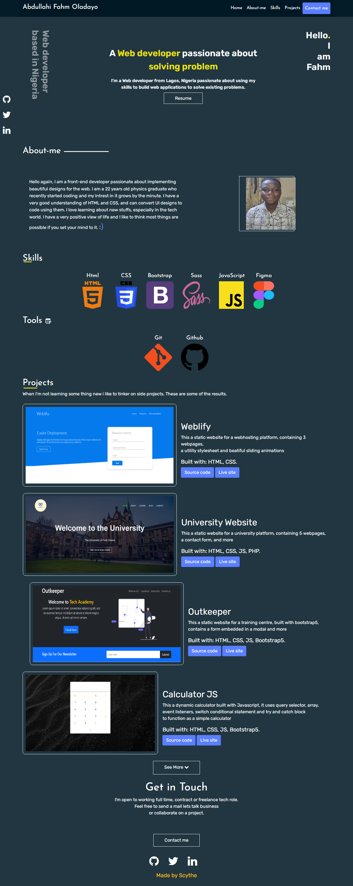

### Portfolio: Abdullahi Fahm Oladayo

#### This is a portfolio site built for myself to show my skills and some of the projects have been working on 

#### It was first designed on figma, built with bootstrap, html and css.

#### Built with Html, CSS, Bootstrap and JavaScript

#### Link to the live website: [Portfolio](https://abdullahi-fahm.netlify.app/ "Portfolio live site")

#### Link to the figma design: [Portfolio Design](https://www.figma.com/file/oDVnSItf3HzBET3S6T6ymB/Portfolio?node-id=0%3A1 "figma link")

#### Design Image
#### Desktop View

#### Credits: Timi Omoyeni